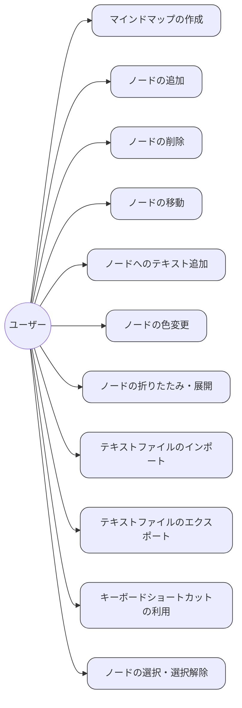

# ユースケース

## アクター

- ユーザー

## ユースケース一覧

1. マインドマップの作成
2. ノードの追加
3. ノードの削除
4. ノードの移動
5. ノードへのテキスト追加
6. ノードの色変更
7. ノードの折りたたみ・展開
8. テキストファイルのインポート
9. テキストファイルのエクスポート
10. キーボードショートカットの利用
11. ノードの選択・選択解除

## ユースケース図

## ユースケース詳細

### 1. マインドマップの作成

- **アクター**: ユーザー
- **概要**: 新しいマインドマップを作成する。
- **事前条件**: なし
- **事後条件**: 空のマインドマップが作成される。
- **操作手順**: アプリケーションのメニューから「新規作成」を選択する。

### 2. ノードの追加

- **アクター**: ユーザー
- **概要**: マインドマップに新しいノードを追加する。
- **事前条件**: マインドマップが存在する。
- **事後条件**: 指定した位置にノードが追加される。
- **操作手順**: ノードを追加したい位置を選択し、右クリックメニューから「ノード追加」を選択する。

### 3. ノードの削除

- **アクター**: ユーザー
- **概要**: マインドマップからノードを削除する。
- **事前条件**: 削除対象のノードが存在する。
- **事後条件**: 指定したノードが削除される。
- **操作手順**: 削除したいノードを選択し、右クリックメニューから「削除」を選択する。

### 4. ノードの移動

- **アクター**: ユーザー
- **概要**: ノードを別の位置に移動する。
- **事前条件**: 移動対象のノードが存在する。
- **事後条件**: ノードが指定した位置に移動される。
- **操作手順**: 移動したいノードをドラッグして、目的の位置にドロップする。

### 5. ノードへのテキスト追加

- **アクター**: ユーザー
- **概要**: ノードにテキストを追加する。
- **事前条件**: 対象のノードが存在する。
- **事後条件**: ノードにテキストが追加される。
- **操作手順**: テキストを追加したいノードをダブルクリックし、テキストを入力する。

### 6. ノードの色変更

- **アクター**: ユーザー
- **概要**: ノードの色を変更する。
- **事前条件**: 対象のノードが存在する。
- **事後条件**: ノードの色が変更される。

### 7. ノードの折りたたみ・展開

- **アクター**: ユーザー
- **概要**: ノードを折りたたむ、または展開する。
- **事前条件**: 対象のノードが存在する。
- **事後条件**: ノードが折りたたまれる、または展開される。

### 8. テキストファイルのインポート

- **アクター**: ユーザー
- **概要**: テキストファイルをインポートしてマインドマップを生成する。
- **事前条件**: インポートするファイルが存在する。
- **事後条件**: ファイルの内容がマインドマップに反映される。

### 9. テキストファイルのエクスポート

- **アクター**: ユーザー
- **概要**: マインドマップをテキストファイルとしてエクスポートする。
- **事前条件**: エクスポートするマインドマップが存在する。
- **事後条件**: マインドマップがテキストファイルとして保存される。

### 10. キーボードショートカットの利用

- **アクター**: ユーザー
- **概要**: キーボードショートカットを使用して操作を効率化する。
- **事前条件**: ショートカットが設定されている。
- **事後条件**: ショートカットに対応した操作が実行される。

### 11. ノードの選択・選択解除

- **アクター**: ユーザー
- **概要**: マインドマップ内のノードを選択または選択解除する。
- **事前条件**: マインドマップが存在する。
- **事後条件**: 指定したノードが選択または選択解除される。
